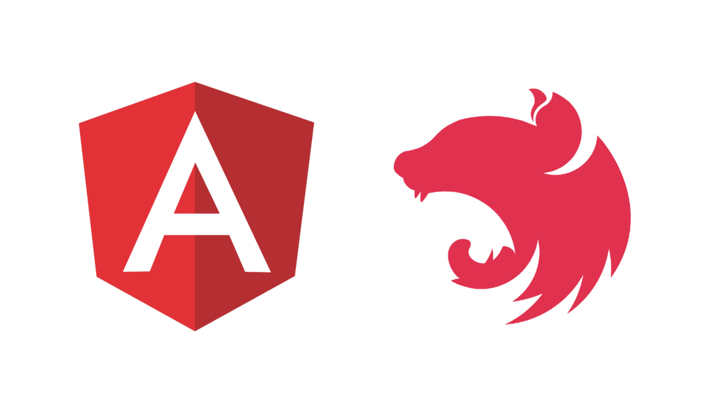

# :rocket: REST API on steroids :syringe: for Angular developer <br/> (and not only)



---


---

# :circus_tent: When frontender picks tech stack for API 

:no_pedestrians: Do I go serverless?

:toilet: Do I use one of those ugly alien (non-JS) languages/frameworks?

:tada: I want to have JS everywhere!

---

# :8ball: Choose among over 9000 Node.js frameworks

[Express](https://expressjs.com/)

[koa](https://koajs.com/)

[hapi](https://hapijs.com/)

[LoopBack](https://loopback.io/)

[restify](http://restify.com/)

[Sails](https://sailsjs.com/)

[Feathers](https://feathersjs.com/)

[Adonis](https://adonisjs.com/)

[Total](https://www.totaljs.com/)

...

---

# :sunglasses: Why I choose NestJS (and you should)

:shit: Opinionated modular design/architecture (maintainable, scalable, battle tested)

:skull: Typescript

:sob: Excellent documentation

:thumbsdown: Great community and support

:sos: Express under the hood (out of the box)

:no_bicycles: Compatibility with other libraries (e.g. Fasify or even custom adapters)

:japanese_ogre: Familiar to Angular developer

:ghost: [Nx](https://nx.dev/)

---

# Awesome Nx

[https://nx.dev/](https://nx.dev/)

NestJS

React

Angular NGRX + missing things (data persistance)

Angular Console

Jest, Cypress

---

# :underage: Building blocks

Modules

Controllers

Providers (Services)

Pipes

Guards

Interceptors

Exception filters

Middlewares

---

# Controllers

```typescript
@Controller('tenants')
export class TenantsController {

  @Post()
  public async create(@Body() dto: CreateTenantDto): Promise<number> {
    const model = await this.tenantsDbConnector.create(dto);

    return model.id;
  }
}
```

[https://example.com/tenants](https://example.com/tenants)

---

# Route parameters

```typescript
@Controller('employees')
export class EmployeesController {

  @Get(':id')
  public async getById(@Param() { id }): Promise<EmployeeDetailsDto> {
    const model = await this.employeesDbConnector.getById(id);

    if (!model) {
      throw new NotFoundException();
    }

    return convertModelToDto({
      model,
      dtoConstructor: EmployeeDetailsDto
    });
  }
}
```

[https://example.com/employees/100500](https://example.com/employees/100500)

---

# Global prefix, custom routes

```typescript
// main.ts
app.setGlobalPrefix('api/v1');

// ...

@Controller('employees')
export class EmployeesController {

  @Post('register')
  public async register(
    @Body() dto: RegisterEmployeeDto
  ): Promise<RegisteredEmployeeDto> {
    // ...
  }
}
```

[https://example.com/api/v1/employees/register](https://example.com/api/v1/employees/register)

---

# DB

[TypeORM](https://github.com/typeorm/typeorm)

[Mongoose](https://github.com/Automattic/mongoose)

---

# Mongoose - configuration

```typescript
const mongoConnStr = process.env.MONGO_CONNECTION_STRING;

@Module({
  imports: [
    MongooseModule.forRoot(mongoConnStr),
    AuthenticationModule,
    EmployeesModule,
    TenantsModule
  ]
})
export class AppModule {}
```

---

# Mongoose - schema definition

```typescript
const schemaDefinition: SchemaDefinition = {
  name: { type: String, required: true },
  roles: [{ type: String, enum: allAppAccessRoles, required: false }]
  isActive: { type: Boolean, required: true },
  login: { type: String, required: true },
  passwordHash: String,
};

const schema = new Schema(schemaDefinition);
schema.pre('save', passwordHashingHook);

export const EmployeeSchema = schema;
```

---

# Mongoose - usage

```typescript
@Module({
  imports: [
    MongooseModule.forFeature([
      { collection: 'Employees', schema: EmployeeSchema }
    ])
  ]
})
export class EmployeesModule {}
// ...

const model = new EmployeeModel({
  name: 'John Snow',
  roles: ['queenSlayer'],
  isActive: false,
  login: 'sweety',
  password: '123456'
});

await model.save();
// ...

const anotherModel = await EmployeeModel.findById('100500').exec();
```

---

# Providers (Services), DI

```typescript
@Injectable()
export class TenantsDbConnectorService {

  constructor(
    private readonly employeesDbConnectorService: EmployeesDbConnectorService,
    @InjectModel('Tenants') private readonly TenantModel: Model<Tenant>
  ) {}

  public async create(dto: CreateTenantDto): Promise<Tenant> {
    const doc = new this.TenantModel(dto);

    await doc.save();

    return doc.toObject();
  }

  public async getById(id: string): Promise<Tenant | null> {
    const doc = await this.TenantModel.findById(id).exec();

    return doc ? doc.toObject() : null;
  }
}
```

---

# Declarative validation

[https://github.com/typestack/class-validator](https://github.com/typestack/class-validator)

```typescript
export class RegisterEmployeeDto {
  @MinLength(3)
  public readonly name: string;

  @IsOptional()
  @ArrayUnique()
  @IsIn(allAppAccessRoles, { each: true })
  @NotEquals('_ADMIN', { each: true })
  public readonly roles?: Array<AppAccessRoles>;

  @Validate(IsNotExpiredJwtTokenValidator)
  public readonly registrationToken: string;
}
```

---

# Custom validators

```typescript
@Injectable()
@ValidatorConstraint()
export class IsNotExpiredJwtTokenValidator implements ValidatorConstraintInterface {

  constructor(private readonly jwt: JwtService) {}

  public validate(value: string): boolean {
    return this.jwt.verify(value);
  }

  public defaultMessage(): string {
    return '$value must be valid and not expired JWT token';
  }
}
```

---

# Validation usage

```typescript
@Post('register')
@UsePipes(new ValidationPipe())
public async register(
  @Body() dto: RegisterEmployeeDto,
): Promise<void> {
  // ...
}
// ...

app.useGlobalPipes(
  new ValidationPipe({
    forbidUnknownValues: true,
  }),
);
```

---

# Guards and authentication

```typescript
@Module({
  imports: [
    PassportModule.register({ defaultStrategy: 'jwt' }),
  ],
})
export class AuthenticationModule {}
// ...

@UseGuards(AuthGuard())
@Put(':id')
public async update(
  @Param() { id }: string,
  @Body() dto: UpdateEmployeeDto,
): Promise<void> {
  // ...
}
```

---

# Roles-based access control

[https://github.com/nestjs-community/nest-access-control](https://github.com/nestjs-community/nest-access-control)

```typescript
export const appRoles = new RolesBuilder();

appRoles.grant('_BASIC')
  .readAny('tenant')
  .createOwn('employee');

appRoles.grant('_ADMIN')
  .extend('_BASIC')
  .updateAny('employee')
  .deleteAny('employee');
// ...

@Module({
  imports: [
    AccessControlModule.forRoles(appRoles),
  ],
})
export class AppModule {}
```

---

# Authorization roles usage

```typescript
@UseGuards(
  AuthGuard(),
  ACGuard,
)
@UseRoles({
  resource: 'employee',
  action: 'update',
  possession: 'any',
})
@Put(':id')
public async update(
  @Param() { id }: string,
  @Body() dto: UpdateEmployeeDto,
): Promise<void> {
  // ...
}
```

---

# Middlewares

```typescript
@Injectable()
export class AddClinicContextMiddleware implements NestMiddleware {
  constructor(private readonly clinicsDbConnector: ClinicsDbConnectorService) {}

  public resolve(): MiddlewareFunction {
    return async (req: AppRequest, res, next) => {
      const requestHost = req.header('host');
      const targetClinic = await this.clinicsDbConnector.getClinicByHostName(requestHost);

      req.body.clinicId = targetClinic.id;
      next();
    };
  }
}
// ...

export class AppModule implements NestModule {
  public configure(consumer: MiddlewareConsumer): void {
    consumer.apply(AddClinicContextMiddleware).forRoutes({
      path: '*',
      method: RequestMethod.POST,
    });
  }
}
```

---

# :rainbow: :carousel_horse: Above and beyond

Websockets

GraphQL

Microservices

Swagger

Sentry

...

---

# :kiss: Thank You so much

Presentation [https://github.com/zd333/nest_talk](https://github.com/zd333/nest_talk)


Additional **very useful** :heart: information


